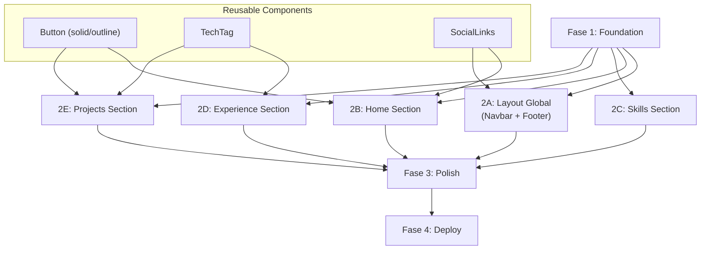
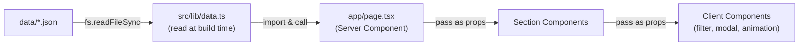
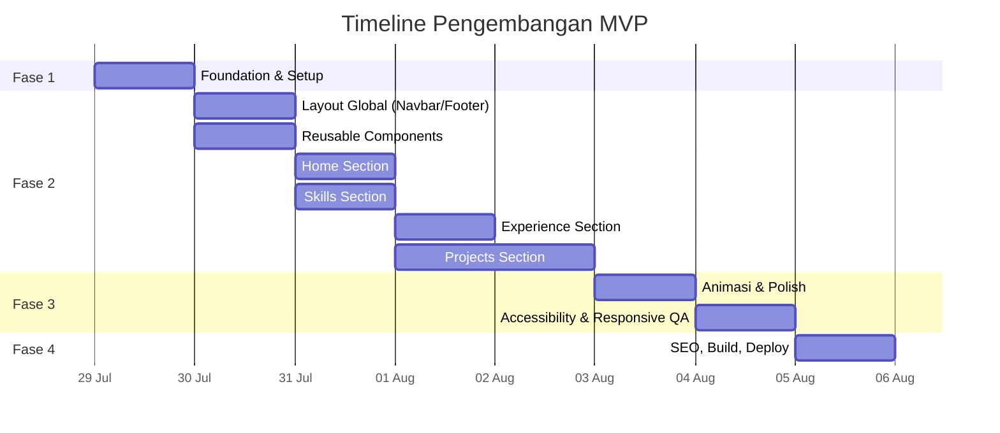

# Project Planning
## Website Portofolio Profesional

> Dokumen ini adalah rencana implementasi teknis yang diturunkan dari [PRD.md](file:///d:/Okik/Coduns/Projects/personal_portofolio/PRD.md) dan [DESIGN.md](file:///d:/Okik/Coduns/Projects/personal_portofolio/DESIGN.md).

---

## 1. Ringkasan Proyek

| Item | Detail |
|------|--------|
| **Produk** | Website portofolio profesional (single-page scroll + detail project route) |
| **Stack** | Next.js (App Router) · Tailwind CSS · Framer Motion · lucide-react |
| **Data** | File JSON lokal (`/data/*.json`) — tanpa backend/database |
| **Deploy** | Vercel (auto-deploy dari GitHub) |
| **Target MVP** | ~6–8 hari kerja |

---

## 2. Struktur Folder (Target Akhir)

```
personal_portofolio/
├── public/
│   ├── images/
│   │   ├── profile/          # Foto profil
│   │   └── projects/         # Thumbnail & screenshot project
│   ├── cv.pdf                # File CV downloadable
│   └── favicon.ico
│
├── data/
│   ├── skills.json
│   ├── experience.json
│   └── projects.json
│
├── src/
│   └── app/
│       ├── layout.tsx        # Root layout (font, metadata global, Navbar, Footer)
│       ├── page.tsx           # Halaman utama (Home + Skills + Experience + Projects)
│       ├── not-found.tsx      # Custom 404
│       ├── globals.css        # Tailwind directives + CSS variables (design tokens)
│       │
│       └── projects/
│           └── [slug]/
│               └── page.tsx   # Detail project (alternatif route, opsional — bisa modal)
│
├── src/components/
│   ├── layout/
│   │   ├── Navbar.tsx
│   │   └── Footer.tsx
│   │
│   ├── home/
│   │   ├── HeroSection.tsx
│   │   ├── StatusBadge.tsx
│   │   └── SocialLinks.tsx
│   │
│   ├── skills/
│   │   ├── SkillsSection.tsx
│   │   ├── SkillCategoryGroup.tsx
│   │   └── SkillBadge.tsx
│   │
│   ├── experience/
│   │   ├── ExperienceSection.tsx
│   │   └── TimelineItem.tsx
│   │
│   ├── projects/
│   │   ├── ProjectsSection.tsx
│   │   ├── ProjectFilterBar.tsx
│   │   ├── ProjectCard.tsx
│   │   └── ProjectDetailModal.tsx
│   │
│   └── ui/
│       ├── Button.tsx         # Variant: solid / outline
│       └── TechTag.tsx        # Badge tech stack (reusable)
│
├── src/lib/
│   ├── data.ts               # Helper: baca & parse JSON data
│   └── types.ts              # TypeScript interfaces
│
├── tailwind.config.ts
├── next.config.ts
├── tsconfig.json
├── package.json
├── PRD.md
├── DESIGN.md
└── PROJECT_PLANNING.md
```

---

## 3. Fase Pengembangan

Proyek dibagi menjadi **4 fase** berurutan. Setiap fase menghasilkan output yang bisa dites/review secara independen.

---

### Fase 1 — Foundation & Setup (~1 hari)

> **Goal:** Project scaffold berjalan, design system siap, data JSON terisi.

| # | Task | Detail | Ref |
|---|------|--------|-----|
| 1.1 | **Init Next.js project** | `npx -y create-next-app@latest ./` dengan App Router, TypeScript, Tailwind CSS, ESLint | PRD §2 |
| 1.2 | **Konfigurasi Tailwind design tokens** | Extend `tailwind.config.ts` dengan color tokens dari DESIGN.md §2.2 (`bg-primary`, `bg-secondary`, `bg-elevated`, `text-primary`, `text-secondary`, `accent`, `accent-soft`, `success`, `border`) | DESIGN §2.2 |
| 1.3 | **Setup typography** | Import font **Inter** (sans) + **JetBrains Mono** (mono) via `next/font/google`, set di `layout.tsx` | DESIGN §2.3 |
| 1.4 | **Setup globals.css** | CSS variables, base styles, `scroll-behavior: smooth`, grid pattern background | DESIGN §2.4, PRD X-3 |
| 1.5 | **Buat file data JSON** | Isi `data/skills.json`, `data/experience.json`, `data/projects.json` dengan data awal sesuai schema PRD §8 | PRD §8 |
| 1.6 | **Buat `src/lib/data.ts`** | Helper functions: `getSkills()`, `getExperience()`, `getProjects()`, `getProjectBySlug()` — baca JSON secara statis | PRD §2 |
| 1.7 | **Siapkan asset** | Foto profil → `public/images/profile/`, CV PDF → `public/cv.pdf`, favicon | PRD H-1, H-6 |

**Deliverable:** `npm run dev` berhasil, halaman kosong tampil dengan warna semi-dark & font benar.

---

### Fase 2 — Core Sections (MVP) (~3–4 hari)

> **Goal:** Semua 4 section utama + Navbar + Footer tampil dengan data dari JSON.

#### 2A — Layout Global (~0.5 hari)

| # | Task | Detail | Ref |
|---|------|--------|-----|
| 2A.1 | **Navbar component** | Sticky, semi-transparan + backdrop-blur, logo/inisial kiri, 4 menu kanan (Home/Skills/Experience/Projects), active state via Intersection Observer, hamburger di mobile | DESIGN §3.1, PRD X-2 |
| 2A.2 | **Footer component** | Nama + copyright kiri, icon social links kanan (GitHub/LinkedIn/Email), background sedikit lebih gelap | DESIGN §3.6, PRD X-8 |
| 2A.3 | **Root layout** | Integrasikan Navbar & Footer di `layout.tsx`, metadata global (title, description, OG tags) | PRD X-6 |

#### 2B — Home Section (~0.5 hari)

| # | Task | Detail | Ref |
|---|------|--------|-----|
| 2B.1 | **HeroSection** | Layout 2 kolom desktop (teks kiri, foto kanan), stack di mobile | DESIGN §3.2 |
| 2B.2 | **StatusBadge** | Badge "Open to Work" dengan dot hijau | PRD H-8 |
| 2B.3 | **Konten hero** | Nama, headline, deskripsi 2-3 kalimat | PRD H-2, H-3, H-4 |
| 2B.4 | **CTA buttons** | "View Projects" (solid accent) → scroll ke Projects, "Download CV" (outline) → buka/download PDF | PRD H-5, H-6 |
| 2B.5 | **SocialLinks** | Icon GitHub, LinkedIn, Email via lucide-react | PRD H-7 |
| 2B.6 | **Foto profil** | Render via `next/image` dengan optimasi | PRD H-1 |

#### 2C — Skills Section (~0.5 hari)

| # | Task | Detail | Ref |
|---|------|--------|-----|
| 2C.1 | **SkillsSection** | Render 5 kategori dari `skills.json` | PRD S-1, S-4 |
| 2C.2 | **SkillCategoryGroup** | Heading kategori + grid skill badges | DESIGN §3.3 |
| 2C.3 | **SkillBadge** | Badge/chip: icon kiri + nama + level label (Familiar/Intermediate/Proficient) | PRD S-2, S-3 |

#### 2D — Experience Section (~0.5 hari)

| # | Task | Detail | Ref |
|---|------|--------|-----|
| 2D.1 | **ExperienceSection** | Render vertical timeline dari `experience.json` | PRD E-2, E-6 |
| 2D.2 | **TimelineItem** | Card: perusahaan, posisi, periode, lokasi, deskripsi, achievements, tech stack tags | PRD E-1 |
| 2D.3 | **Responsive timeline** | Desktop: periode kiri + card kanan. Mobile: stacked full-width | PRD E-3, DESIGN §3.4 |
| 2D.4 | **TechTag** | Badge kecil reusable untuk tech stack | PRD E-4 |

#### 2E — Projects Section (~1–1.5 hari)

| # | Task | Detail | Ref |
|---|------|--------|-----|
| 2E.1 | **ProjectsSection** | Render grid card dari `projects.json` | PRD P-1 |
| 2E.2 | **ProjectFilterBar** | Filter pill buttons: All, Web Development, Backend, Cyber Security, Mobile (client-side state) | PRD P-3, DESIGN §3.5 |
| 2E.3 | **ProjectCard** | Thumbnail (`next/image`), judul, deskripsi singkat, tech stack chips, tombol aksi (Live Demo/GitHub/Detail) | PRD P-2 |
| 2E.4 | **ProjectDetailModal** | Modal overlay: galeri screenshot, latar belakang, role, fitur utama, tech stack, tantangan & solusi | PRD P-4, P-5, DESIGN §3.5 |
| 2E.5 | **Tombol opsional** | Live Demo / GitHub hanya tampil jika URL tersedia di JSON | PRD P-6 |
| 2E.6 | **Button component** | Reusable dengan variant solid/outline + icon support | DESIGN §4 |

**Deliverable:** Website lengkap 4 section, data-driven, navigable, responsive.

---

### Fase 3 — Polish & Enhancement (~1–2 hari)

> **Goal:** Animasi, interaksi halus, accessibility, dan fitur nice-to-have.

| # | Task | Detail | Prioritas | Ref |
|---|------|--------|-----------|-----|
| 3.1 | **Animasi Home** | Fade-in + slide-up staggered pada load (Framer Motion) | MVP | DESIGN §5 |
| 3.2 | **Scroll reveal** | Fade + slide-in pada Experience & Projects (Framer Motion `whileInView`) | Nice-to-have | PRD E-5, DESIGN §5 |
| 3.3 | **Hover effects** | Scale halus (1.02x) + border glow pada card/badge | Nice-to-have | DESIGN §5 |
| 3.4 | **Dark/Light mode** | Toggle dengan Tailwind `dark:` class + localStorage persistence | Nice-to-have | PRD X-4 |
| 3.5 | **Custom 404** | Halaman not-found bertema sesuai design system | Nice-to-have | PRD X-7 |
| 3.6 | **Loading animation** | Animasi ringan saat initial load | Nice-to-have | PRD X-5 |
| 3.7 | **Accessibility audit** | Kontras WCAG AA, aria-labels, `prefers-reduced-motion`, keyboard nav pada filter/modal | MVP | DESIGN §7 |
| 3.8 | **Responsive QA** | Test di mobile (<640px), tablet (640-1024px), desktop (>1024px) | MVP | DESIGN §6 |

**Deliverable:** Website terasa premium, animasi halus, accessible.

---

### Fase 4 — Deploy & Final QA (~0.5 hari)

| # | Task | Detail | Ref |
|---|------|--------|-----|
| 4.1 | **SEO metadata** | Verifikasi `generateMetadata`, title tags, meta descriptions, Open Graph tags | PRD X-6 |
| 4.2 | **Performance audit** | Lighthouse score check (target: Performance ≥ 90, Accessibility ≥ 90) | PRD §7 |
| 4.3 | **Build test** | `npm run build` — pastikan tidak ada error, static output benar | — |
| 4.4 | **Deploy ke Vercel** | Connect repo GitHub → auto-detect Next.js → deploy | PRD §9 |
| 4.5 | **Post-deploy QA** | Test di production: semua link, download CV, modal, filter, responsive | — |
| 4.6 | **Dynamic route (opsional)** | `/projects/[slug]` via `generateStaticParams` sebagai fallback/SEO-friendly alternative dari modal | PRD §3 |

**Deliverable:** Website live di Vercel, siap di-share ke recruiter.

---

## 4. Dependency Graph



> [!NOTE]
> Section 2B–2E bisa dikerjakan **paralel** setelah Fase 1 selesai, namun disarankan mengerjakan reusable components (`Button`, `TechTag`, `SocialLinks`) terlebih dahulu di awal Fase 2.

---

## 5. Component Inventory & Mapping

| Komponen | Props Utama | Digunakan di | Tipe |
|----------|-------------|--------------|------|
| `Navbar` | — | `layout.tsx` (global) | Client Component |
| `Footer` | — | `layout.tsx` (global) | Server Component |
| `HeroSection` | — | `page.tsx` → Home | Server + Client |
| `StatusBadge` | `status: string` | HeroSection | Server Component |
| `SocialLinks` | `variant: 'hero' \| 'footer'` | HeroSection, Footer | Server Component |
| `Button` | `variant: 'solid' \| 'outline'`, `href?`, `onClick?` | Home, Projects | Server/Client |
| `SkillsSection` | `skills: SkillCategory[]` | `page.tsx` → Skills | Server Component |
| `SkillCategoryGroup` | `category: SkillCategory` | SkillsSection | Server Component |
| `SkillBadge` | `skill: Skill` | SkillCategoryGroup | Server Component |
| `ExperienceSection` | `experiences: Experience[]` | `page.tsx` → Experience | Server Component |
| `TimelineItem` | `experience: Experience` | ExperienceSection | Client Component |
| `TechTag` | `name: string` | TimelineItem, ProjectCard | Server Component |
| `ProjectsSection` | `projects: Project[]` | `page.tsx` → Projects | Client Component |
| `ProjectFilterBar` | `categories`, `active`, `onChange` | ProjectsSection | Client Component |
| `ProjectCard` | `project: Project` | ProjectsSection | Client Component |
| `ProjectDetailModal` | `project: Project`, `isOpen`, `onClose` | ProjectsSection | Client Component |

---

## 6. Data Flow



> [!IMPORTANT]
> Data JSON dibaca saat **build time** (Static Generation). Tidak ada fetch runtime. Setiap perubahan data memerlukan rebuild / redeploy.

---

## 7. TypeScript Interfaces

```typescript
// src/lib/types.ts

interface Skill {
  name: string;
  icon: string;
  level?: 'Familiar' | 'Intermediate' | 'Proficient';
}

interface SkillCategory {
  category: string;
  items: Skill[];
}

interface Experience {
  company: string;
  position: string;
  period: string;
  location: string;
  description: string;
  achievements: string[];
  techStack: string[];
}

interface ProjectDetail {
  background: string;
  role: string;
  mainFeatures: string[];
  techStack: string[];
  challenges: string;
  solution: string;
  screenshots: string[];
}

interface Project {
  slug: string;
  name: string;
  thumbnail: string;
  shortDescription: string;
  category: 'Web Development' | 'Backend' | 'Cyber Security' | 'Mobile';
  techStack: string[];
  liveDemoUrl: string | null;
  githubUrl: string | null;
  detail: ProjectDetail;
}
```

---

## 8. Acceptance Criteria (Checklist)

### Home
- [ ] Foto profil tampil dan ter-optimasi (`next/image`)
- [ ] Nama, headline, deskripsi singkat terlihat jelas
- [ ] Badge "Open to Work" dengan dot hijau
- [ ] CTA "View Projects" scroll ke section Projects
- [ ] CTA "Download CV" membuka/download file PDF
- [ ] Link sosial (GitHub, LinkedIn, Email) berfungsi
- [ ] Layout 2 kolom (desktop) → stack (mobile)

### Skills
- [ ] 5 kategori skill tampil dengan heading masing-masing
- [ ] Setiap skill berupa badge dengan icon + nama
- [ ] Level skill (jika ada) tampil sebagai label/warna, bukan progress bar
- [ ] Data dibaca dari `skills.json`

### Experience
- [ ] Timeline vertikal dengan garis & dot
- [ ] Setiap entri menampilkan: perusahaan, posisi, periode, lokasi, deskripsi, achievements, tech stack
- [ ] Responsive: desktop 2 sisi → mobile stacked
- [ ] Data dibaca dari `experience.json`

### Projects
- [ ] 3–6 project tampil dalam grid responsif (3→2→1 kolom)
- [ ] Filter berdasarkan kategori berfungsi (client-side)
- [ ] Card menampilkan: thumbnail, judul, deskripsi, tech stack, tombol aksi
- [ ] Modal detail project menampilkan informasi lengkap
- [ ] Tombol Live Demo / GitHub hanya muncul jika URL tersedia
- [ ] Data dibaca dari `projects.json`

### Cross-cutting
- [ ] Navbar sticky dengan active state mengikuti section
- [ ] Smooth scrolling antar section
- [ ] Responsive di mobile, tablet, desktop
- [ ] SEO metadata (title, description, OG tags)
- [ ] Accessibility: kontras WCAG AA, aria-labels, keyboard navigable
- [ ] Build tanpa error (`npm run build`)
- [ ] Deploy berhasil di Vercel

---

## 9. Timeline Estimasi



| Fase | Estimasi | Kumulatif |
|------|----------|-----------|
| Fase 1: Foundation | 1 hari | 1 hari |
| Fase 2: Core Sections | 3–4 hari | 4–5 hari |
| Fase 3: Polish | 1–2 hari | 5–7 hari |
| Fase 4: Deploy & QA | 0.5 hari | **~6–8 hari** |

> [!TIP]
> Timeline di atas mengasumsikan pengerjaan solo. Jika ada bagian yang sudah familiar atau menggunakan template/boilerplate, bisa lebih cepat 1–2 hari.

---

## 10. Risiko & Mitigasi

| Risiko | Dampak | Mitigasi |
|--------|--------|----------|
| Asset belum siap (foto, screenshot project) | Delay konten visual | Gunakan placeholder sementara, siapkan asset paralel |
| Data project kurang detail | Halaman detail terasa kosong | Isi minimal 3 project lengkap sebelum mulai coding |
| Overengineering animasi | Waktu development membengkak | Prioritaskan MVP tanpa animasi, tambahkan di Fase 3 |
| Lighthouse score rendah | Kesan tidak profesional | Test berkala, optimalkan gambar via `next/image`, minimize JS bundle |

---

## 11. Urutan Eksekusi (Quick Reference)

```
1.  npx create-next-app → setup Tailwind tokens & fonts
2.  Buat data/*.json dengan konten awal
3.  Buat lib/data.ts + lib/types.ts
4.  Buat Button, TechTag, SocialLinks (reusable)
5.  Buat Navbar + Footer → pasang di layout.tsx
6.  Buat HeroSection (Home)
7.  Buat SkillsSection (Skills)
8.  Buat ExperienceSection (Experience)
9.  Buat ProjectsSection + FilterBar + Card + Modal (Projects)
10. Pasang semua section di page.tsx
11. Tambahkan animasi (Framer Motion)
12. Responsive & accessibility QA
13. SEO metadata & Lighthouse audit
14. npm run build 
```
